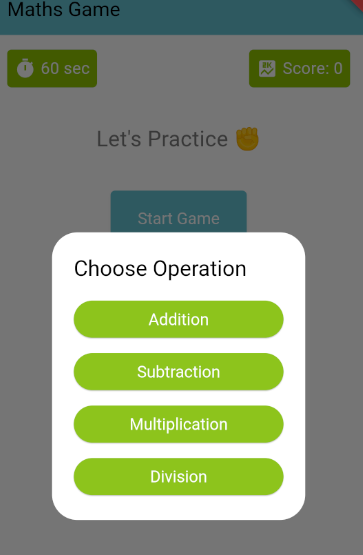
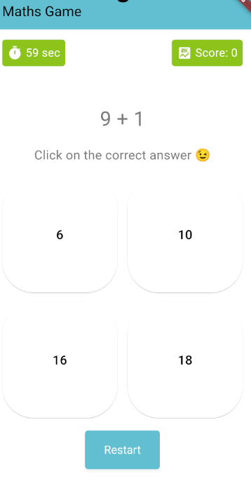
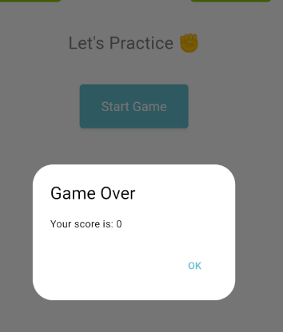

Maths Game

A simple Flutter-based mathematics game where users can practice basic arithmetic operations like addition, subtraction, multiplication, and division. The game is designed with a child-friendly interface and provides instant feedback on correct and incorrect answers.

## Table of Contents

- [Features](#features)
- [Screenshots](#screenshots)
- [Installation](#installation)
- [Usage](#usage)
- [Customization](#customization)
- [License](#license)

## Features

- Practice basic arithmetic operations (Addition, Subtraction, Multiplication, Division).
- Simple and child-friendly interface.
- Score tracking with real-time feedback:
  - +1 for a correct answer.
  - -1 for an incorrect answer, but the score does not go below 0.
- Displays "Correct" or "Try again" feedback without changing the question.
- Timer functionality to challenge the user to solve as many questions as possible within the time limit.

## Screenshots

## Installation

To run this project on your local machine, follow these steps:

1. **Clone the repository:**

git clone https://github.com/sissy-ch/maths_game(mobile).git
cd maths_game

2. **Install the dependencies:**

Ensure that you have Flutter installed on your system. If not, follow the official Flutter installation guide.

flutter pub get

3. **Run the app:**

You can run the app on an emulator or a physical device.

flutter run

## Usage

Upon starting the game, you can select the arithmetic operation you want to practice.

Solve the given mathematical questions by selecting the correct answer from the four options.

The game keeps track of your score and provides instant feedback.
You can restart the game at any time by pressing the "Restart" button.

## Customization

You can customize the game by modifying the following:

Colors: Adjust the color scheme in the ThemeData section of main.dart.

Operations: Modify or add more arithmetic operations in the generateQA function in MathsGameHomePage.

Timer: Adjust the countdown timer duration by changing the timeRemaining variable.

## License

This project is licensed under the MIT License - see the LICENSE file for details.
